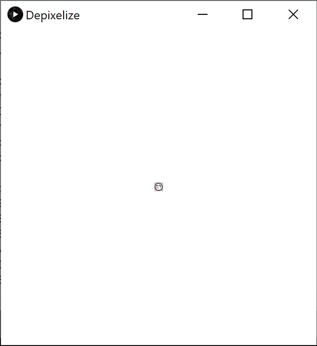
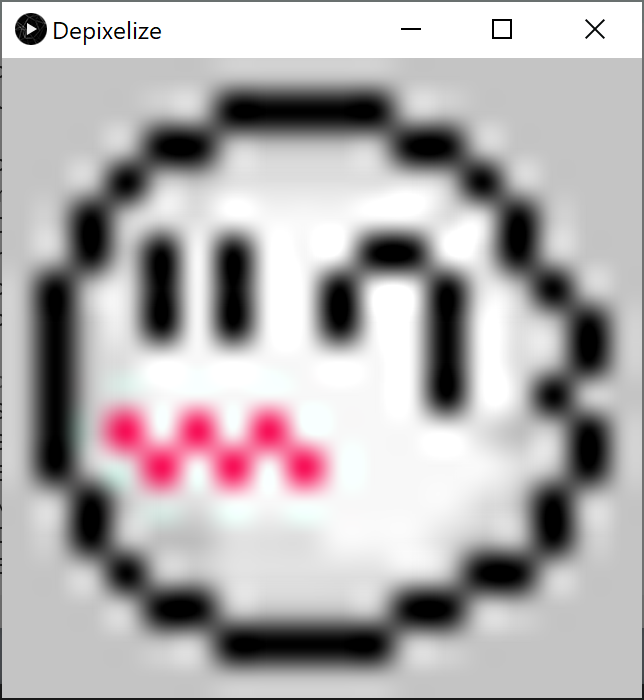
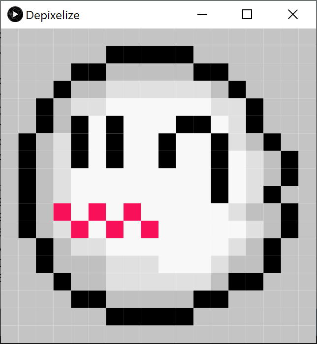
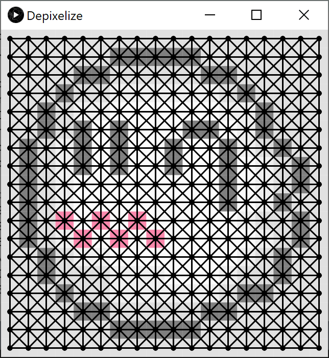
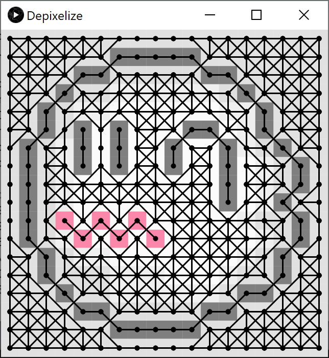
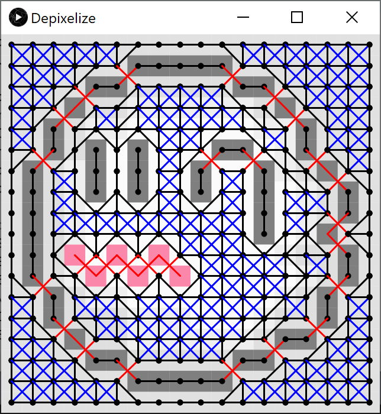
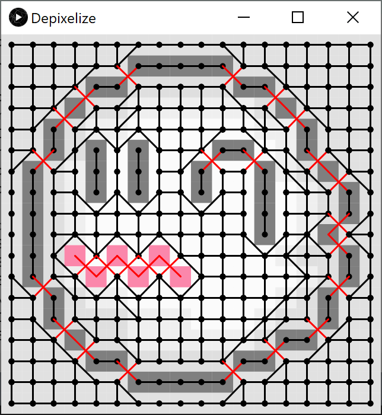
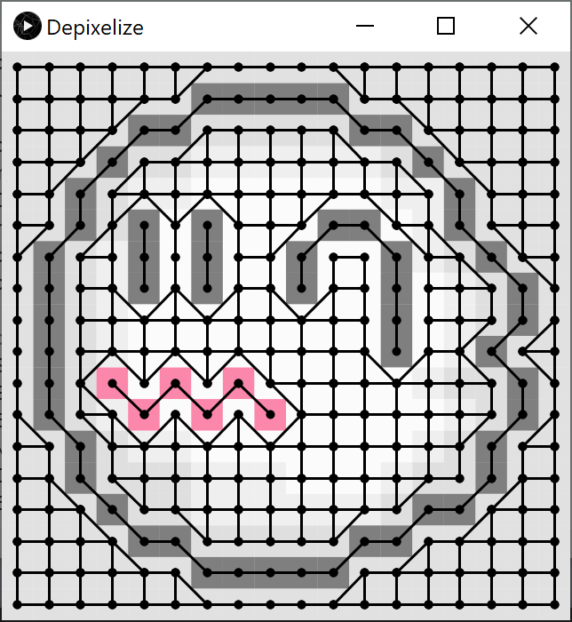
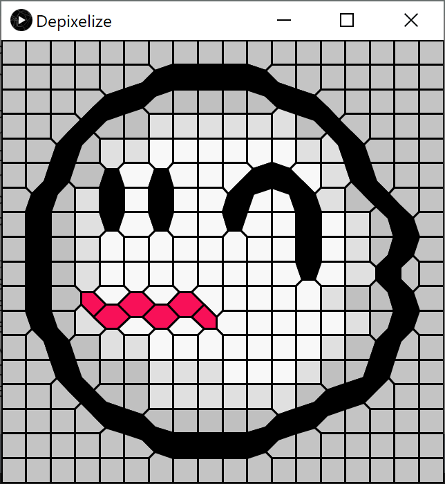

Tested on:
 
OS: Windows 10 64-bit
 
IDE: Processing 3.5.4 + VSCode
 
GPU: Intel HD Graphics 5500 128MB
 
CPU: i5-5300U @ 2.30GHz
 
RAM: 8GB

Setup:
- Install Processing 3 on your machine

Running the Program:
- Open Depixelize.pde in the Depixelize folder

- Press the space key to cycle through the different stages in the algorithm:
    1) Frame 1: Pixel art rendered at its original resolution (very tiny)
    2) Frame 2: Procesing's scale to full screen (very blurry)
    3) Frame 3: Pixel Scaling to full screen by looping through all pixels and drawing rectangles
    4) Frame 4: Fully connected similarity graph of all pixels
    5) Frame 5: Similarity graph with all edges between pixels with dissimilar edges cut off
    6) Frame 6: Similarity graph with crossings color-coded, blue -> part of a continously shaded region, so can be removed safely,
                red -> ambiguous crossings since both edges are different colors, so requires some heuristics to determine which edge
                to remove.
    7) Frame 7: Similarity graph with blue crossings removed
    8) Frame 8: Similarity graph with red crossings resolved and removed
    9) Frame 9: Dual/Voronoi Diagram generated from similarity graph which has the desired properties

- Press keys 1-9 to (reset and) change the pixel art to apply the algorithm on

Frame 1:
 

Frame 2:
 

Frame 3:
 

Frame 4:
 

Frame 5:
 

Frame 6:
 

Frame 7:
 

Frame 8:
 

Frame 9:
 

